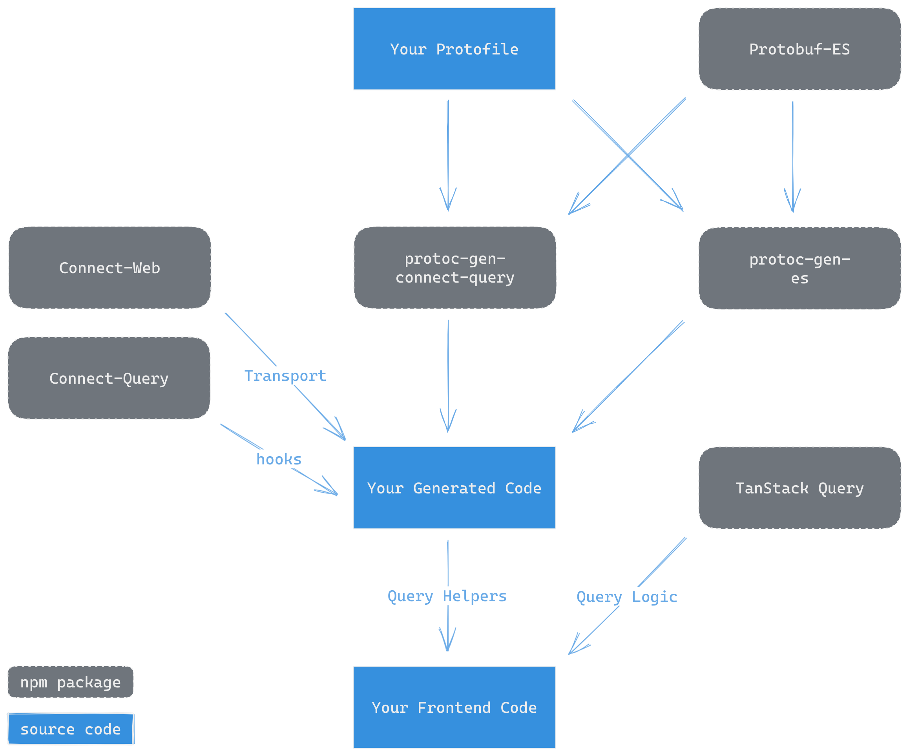

<!-- markdownlint-disable-next-line MD041 MD033 -- 033: necessary for setting the width; 041: this is the style of bufbuild READMEs -->


<!-- omit in toc -->
# Connect-Query

Connect-Query is an expansion pack for [TanStack Query](https://tanstack.com/query) (react-query), written in TypeScript and thoroughly tested.  It enables effortless communication with servers that speak the [Connect Protocol](https://connect.build/docs/protocol).

- [Quickstart](#quickstart)
  - [Generated Code](#generated-code)
- [Connect-Query API](#connect-query-api)
  - [`createQueryService`](#createqueryservice)
  - [`TransportProvider`](#transportprovider)
  - [`useTransport`](#usetransport)
  - [`UnaryHooks.createData`](#unaryhookscreatedata)
  - [`UnaryHooks.createUseQueryOptions`](#unaryhookscreateusequeryoptions)
  - [`UnaryHooks.getPartialQueryKey`](#unaryhooksgetpartialquerykey)
  - [`UnaryHooks.getQueryKey`](#unaryhooksgetquerykey)
  - [`UnaryHooks.methodInfo`](#unaryhooksmethodinfo)
  - [`UnaryHooks.setQueryData`](#unaryhookssetquerydata)
  - [`UnaryHooks.setQueriesData`](#unaryhookssetqueriesdata)
  - [`UnaryHooks.useInfiniteQuery`](#unaryhooksuseinfinitequery)
  - [`UnaryHooks.useMutation`](#unaryhooksusemutation)
  - [`UnaryHooks.useQuery`](#unaryhooksusequery)
  - [`ConnectQueryKey`](#connectquerykey)
  - [`ConnectPartialQueryKey`](#connectpartialquerykey)
- [Frequently Asked Questions](#frequently-asked-questions)
  - [How do I pass other TanStack Query options?](#how-do-i-pass-other-tanstack-query-options)
  - [Is this ready for production?](#is-this-ready-for-production)
  - [What is Connect-Query's relationship to Connect-Web and Protobuf-ES?](#what-is-connect-querys-relationship-to-connect-web-and-protobuf-es)
  - [What is `Transport`](#what-is-transport)
  - [What if I already use Connect-Web?](#what-if-i-already-use-connect-web)
  - [What if I use gRPC-web?](#what-if-i-use-grpc-web)
  - [Do I have to use a code generator?](#do-i-have-to-use-a-code-generator)
  - [What if I have a custom `Transport`?](#what-if-i-have-a-custom-transport)
  - [Does this only work with React?](#does-this-only-work-with-react)
    - [SolidJS Example](#solidjs-example)
  - [What about Streaming?](#what-about-streaming)

# Quickstart

## Install

```sh
npm install @bufbuild/connect-query
```

Note: If you are using something that doesn't automatically install peerDependencies (npm older than v7), you'll want to make sure you also have `@bufbuild/protobuf` and `@bufbuild/connect` installed.

## Usage

Connect-Query will immediately feel familiar to you if you've used TanStack Query.  It provides a set of convenient helpers that you can pass to the same TanStack Query functions you're already using:

```ts
import { useQuery } from '@tanstack/react-query';
import { example } from 'your-generated-code/example-ExampleService_connectquery';

export const Example: FC = () => {
  const { data } = useQuery(example.useQuery({}));
  return <div>{data}</div>;
};
```

**_That's it!_**

The [code generator](packages/protoc-gen-connect-query/README.md) does all the work of turning your Protobuf file into something you can easily import.  TypeScript types all populate out-of-the-box.  Your documentation is also converted to [TSDoc](https://tsdoc.org/).

One of the best features of this library is that once you write your schema in Protobuf form, the TypeScript types are generated and then inferred.  You never again need to specify the types of your data since the library does it automatically.

<!-- markdownlint-disable-next-line MD033 -- necessary for centering -->
<div align="center">
  <!-- markdownlint-disable-next-line MD033 -- necessary for cross-renderer video (i.e. not just on GitHub) -->
  <video src="https://user-images.githubusercontent.com/15232461/212362170-65eb9efa-faa5-46fd-ac61-080719d011a5.mp4" />
</div>

<!-- markdownlint-disable-next-line MD033 -- necessary for making the text small (and lessening top margin) -->
<sup>
  <!-- markdownlint-disable-next-line MD033 -- necessary for centering -->
  <p align="center">
    <!-- markdownlint-disable-next-line MD033 -- necessary for making the text italic inside of a `p` tag -->
    <em>
      play the above video to see the TypeScript types in action
    </em>
  </p>
</sup>
<!-- markdownlint-disable-next-line MD033 -- provides half line break between next paragraph -->
<dl></dl>

## Generated Code

This example shows the best developer experience using code generation.  Here's what that generated code looks like:

```ts title="your-generated-code/example-ExampleService_connectquery"
import { createQueryService } from "@bufbuild/connect-query";
import { MethodKind } from "@bufbuild/protobuf";
import { ExampleRequest, ExampleResponse } from "./example_pb.js";

export const example = createQueryService({
  service: {
    methods: {
      example: {
        name: "Example",
        kind: MethodKind.Unary,
        I: ExampleRequest,
        O: ExampleResponse,
      },
    },
    typeName: "your.company.com.example.v1.ExampleService",
  },
}).example;
```

If you want to use Connect-Query dynamically without code generation, you can call [`createQueryService`](#createqueryservice) exactly as the generated code does.

For more information on code generation, see the [documentation](./packages/protoc-gen-connect-query/README.md) for `protoc-gen-connect-query`.

# Connect-Query API

## `createQueryService`

```ts
const createQueryService: <Service extends ServiceType>({
  service,
  transport,
}: {
  service: Service;
  transport?: Transport;
}) => QueryHooks<Service>
```

`createQueryService` is the main entrypoint for Connect-Query.

Pass in a service and you will receive an object with properties for each of your services and values that provide hooks for those services that you can then give to Tanstack Query.  The `ServiceType` TypeScript interface is provided by Protobuf-ES (`@bufbuild/protobuf`) while generated service definitions are provided by Connect-Web (`@bufbuild/connect-web`).

`Transport` refers to the mechanism by which your client will make the actual network calls.  If you want to use a custom transport, you can optionally provide one with a call to `useTransport`, which Connect-Query exports.  Otherwise, the default transport from React context will be used.  This default transport is placed on React context by the `TransportProvider`. Whether you pass a custom transport or you use `TransportProvider`, in both cases you'll need to use one of `@bufbuild/connect-web`'s exports `createConnectTransport` or `createGrpcWebTransport`.

Note that the most memory performant approach is to use the transport on React Context by using the `TransportProvider` because that provider is memoized by React, but also that any calls to `createQueryService` with the same service is cached by this function.

Here's an example of a simple usage:

```ts
export const { say } = createQueryService({
  service: {
    methods: {
      say: {
        name: "Say",
        kind: MethodKind.Unary,
        I: SayRequest,
        O: SayResponse,
      },
    },
    typeName: "buf.connect.demo.eliza.v1.ElizaService",
  },
});

const { data, isLoading, ...etc } = useQuery(say.useQuery());
```

## `TransportProvider`

> Note: This API can only be used with React

```ts
const TransportProvider: FC<PropsWithChildren<{
  transport: Transport;
}>>;
```

`TransportProvider` is the main mechanism by which Connect-Query keeps track of the `Transport` used by your application.

Broadly speaking, "transport" joins two concepts:

  1. The protocol of communication.  For this there are two options: the [Connect Protocol](https://connect.build/docs/protocol/), or the [gRPC-Web Protocol](https://github.com/grpc/grpc/blob/master/doc/PROTOCOL-WEB.md).
  1. The protocol options.  The primary important piece of information here is the `baseUrl`, but there are also other potentially critical options like request credentials and binary wire format encoding options.

With these two pieces of information in hand, the transport provides the critical mechanism by which your app can make network requests.

To learn more about the two modes of transport, take a look at the Connect-Web documentation on [choosing a protocol](https://connect.build/docs/web/choosing-a-protocol/).

To get started with Connect-Query, simply import a transport (either [`createConnectTransport`](https://github.com/bufbuild/connect-web/blob/main/packages/connect-web/src/connect-transport.ts) or [`createGrpcWebTransport`](https://github.com/bufbuild/connect-web/blob/main/packages/connect-web/src/grpc-web-transport.ts) from [`@bufbuild/connect-web`](https://www.npmjs.com/package/@bufbuild/connect-web)) and pass it to the provider.

```tsx
import { QueryClient, QueryClientProvider } from "@tanstack/react-query";
import { TransportProvider } from "@bufbuild/connect-query";

const queryClient = new QueryClient();

export const App() {
  const transport = createConnectTransport({
    baseUrl: "<your baseUrl here>",
  });
  return (
    <TransportProvider transport={transport}>
      <QueryClientProvider client={queryClient}>
         <YourApp />
      </QueryClientProvider>
    </TransportProvider>
  );
}
```

## `useTransport`

> Note: This API can only be used with React

```ts
const useTransport: () => Transport;
```

Use this helper to get the default transport that's currently attached to the React context for the calling component.

## `UnaryHooks.createData`

```ts
const createData: (data: PartialMessage<O>) => O;
```

Use this to create a data object that can be used as `placeholderData` or initialData.

## `UnaryHooks.createUseQueryOptions`

```ts
const createUseQueryOptions: (
 input: DisableQuery | PartialMessage<I> | undefined,
 options: {
   getPlaceholderData?: (enabled: boolean) => PartialMessage<O> | undefined;
   onError?: (error: ConnectError) => void;
   transport: Transport;
   callOptions?: CallOptions | undefined;
 },
) => {
 enabled: boolean;
 queryKey: ConnectQueryKey<I>;
 queryFn: (context?: QueryFunctionContext<ConnectQueryKey<I>>) => Promise<O>;
 placeholderData?: () => O | undefined;
 onError?: (error: ConnectError) => void;
};
```

`createUseQueryOptions` is intended to be used with TanStack's [`useQuery`](https://tanstack.com/query/v4/docs/react/reference/useQuery) hook.  The difference is that `createUseQueryOptions` is not a hook.  Since hooks cannot be called conditionally, it can sometimes be helpful to use `createUseQueryOptions` to prepare an input to TanStack's `useQuery`.

It is also useful to use alongside TanStack's [`useQueries`](https://tanstack.com/query/v4/docs/react/reference/useQueries) hook since hooks cannot be called in loops.

## `UnaryHooks.getPartialQueryKey`

```ts
const getPartialQueryKey: () => ConnectPartialQueryKey;
```

This helper is useful for getting query keys matching a wider set of queries associated to this Connect `Service`, per TanStack Query's [partial matching](https://tanstack.com/query/v4/docs/react/guides/query-invalidation#query-matching-with-invalidatequeries) mechanism.

## `UnaryHooks.getQueryKey`

```ts
const getQueryKey: (input?: DisableQuery | PartialMessage<I>) => ConnectQueryKey<I>;
```

This helper is useful to manually compute the [`queryKey`](https://tanstack.com/query/v4/docs/react/guides/query-keys) sent to TanStack Query.  This function has no side effects.

## `UnaryHooks.methodInfo`

```ts
const methodInfo: MethodInfoUnary<I, O>;
```

This is the metadata associated with this method.

## `UnaryHooks.setQueryData`

```ts
const setQueryData: (
  updater: PartialMessage<O> | (
    (prev?: O) => PartialMessage<O>
  ),
  input?: PartialMessage<I>,
) => [
  queryKey: ConnectQueryKey<I>,
  updater: (prev?: O) => O | undefined
];
```

This helper is intended to be used with TanStack Query `QueryClient`'s [`setQueryData`](https://tanstack.com/query/v4/docs/react/reference/QueryClient#queryclientsetquerydata) function.

## `UnaryHooks.setQueriesData`

```ts
const setQueriesData: (
  updater: PartialMessage<O> | (
    (prev?: O) => PartialMessage<O>
  ),
) => [
  queryKey: ConnectPartialQueryKey,
  updater: (prev?: O) => O | undefined
];
```

This helper is intended to be used with TanStack Query `QueryClient`'s [`setQueriesData`](https://tanstack.com/query/v4/docs/react/reference/QueryClient#queryclientsetqueriesdata) function.

## `UnaryHooks.useInfiniteQuery`

> Note: This API can only be used with React

```ts
const useInfiniteQuery: <ParamKey extends keyof PlainMessage<I>>(
  input: DisableQuery | PartialMessage<I>,
  options: {
    pageParamKey: ParamKey;
    getNextPageParam: (lastPage: O, allPages: O[]) => unknown;
    onError?: (error: ConnectError) => void;
    transport?: Transport | undefined;
    callOptions?: CallOptions | undefined;
  },
) => {
  enabled: boolean;
  queryKey: ConnectQueryKey<I>;
  queryFn: (
    context: QueryFunctionContext<
      ConnectQueryKey<I>,
      PlainMessage<I>[ParamKey]
    >,
  ) => Promise<O>;
  getNextPageParam: GetNextPageParamFunction<O>;
  onError?: (error: ConnectError) => void;
};
```

This helper is intended to be used with TanStack Query's [`useInfiniteQuery`](https://tanstack.com/query/v4/docs/react/reference/useInfiniteQuery) function.

## `UnaryHooks.useMutation`

> Note: This API can only be used with React

```ts
const useMutation: (options?: {
  onError?: (error: ConnectError) => void;
  transport?: Transport | undefined;
  callOptions?: CallOptions | undefined;
}) => {
  mutationFn: (
    input: PartialMessage<I>,
    context?: QueryFunctionContext<ConnectQueryKey<I>>,
  ) => Promise<O>;
  onError?: (error: ConnectError) => void;
};
```

This function is intended to be used with TanStack Query's [`useMutation`](https://tanstack.com/query/v4/docs/react/reference/useMutation) function.

## `UnaryHooks.useQuery`

> Note: This API can only be used with React

```ts
const useQuery: (
  input?: DisableQuery | PartialMessage<I>,
  options?: {
    getPlaceholderData?: (enabled: boolean) => PartialMessage<O> | undefined;
    onError?: (error: ConnectError) => void;
    transport?: Transport | undefined;
    callOptions?: CallOptions | undefined;
  },
) => {
  enabled: boolean;
  queryKey: ConnectQueryKey<I>;
  queryFn: (context?: QueryFunctionContext<ConnectQueryKey<I>>) => Promise<O>;
  placeholderData?: () => O | undefined;
  onError?: (error: ConnectError) => void;
};
```

This function is intended to be used with Tanstack Query's [`useQuery`](https://tanstack.com/query/v4/docs/react/reference/useQuery) function.

## `ConnectQueryKey`

```ts
type ConnectQueryKey<I extends Message<I>> = [
  serviceTypeName: string,
  methodName: string,
  input: PartialMessage<I>,
];
```

TanStack Query requires query keys in order to decide when the query should automatically update.

[`QueryKey`s](https://tanstack.com/query/v4/docs/react/guides/query-keys) in TanStack Query are usually arbitrary, but Connect-Query uses the approach of creating a query key that begins with the least specific information: the service's `typeName`, followed by the method name, and ending with the most specific information to identify a particular request: the input message itself.

For example, a query key might look like this:

```ts
[
  "buf.connect.demo.example.v1.ExampleService",
  "GetTodos",
  { id: "0fdf2ebe-9a0c-4366-9772-cfb21346c3f9" },
]
```

## `ConnectPartialQueryKey`

This type is useful In situations where you want to use partial matching for TanStack Query `queryKey`s.

```ts
type ConnectPartialQueryKey = [
  serviceTypeName: string,
  methodName: string,
];
```

For example, a partial query key might look like this:

```ts
[
  "buf.connect.demo.example.v1.ExampleService",
  "GetTodos",
]
```

# Frequently Asked Questions

## How do I pass other TanStack Query options?

Say you have an query that looks something like this:

```ts
import { useQuery } from '@tanstack/react-query';
import { example } from 'your-generated-code/example-ExampleService_connectquery';

export const Example: FC = () => {
  const { data } = useQuery(example.useQuery({}));
  return <div>{data}</div>;
};
```

On line 5, `example.useQuery({})` just returns an object with a few TanStack Query options preconfigured for you (for example, `queryKey` and `queryFn` and `onError`).  All of the Connect-Query hooks APIs work this way, so you can always inspect the TypeScript type to see which specific TanStack query options are configured.

That means, that if you want to add extra TanStack Query options, you can simply spread the object resulting from Connect-Query:

```ts
  const { data } = useQuery({
    ...example.useQuery({}),

    // Add any extra TanStack Query options here.
    // TypeScript will ensure they're valid!
    refetchInterval: 1000,
  });
```

> Why does it work this way?
>
> You may be familiar with other projects that directly wrap react-query directly (such as tRPC).  We worked with the TanStack team to develop this API and determined that it's most flexible to simply return an options object.
>
> 1. You have full control over what's actually passed to TanStack Query.  For example, if you have a query where you'd like to modify the `queryKey`, you can do so directly.
> 1. It provides full transparency into what Connect Query is actually doing.  This means that if you want to see what _exactly_ Connect Query is doing, you can simply inspect the object.  This makes for a much more straightforward experience when you're debugging your app.
> 1. This means that the resulting call is plain TanStack Query in every way, which means that you can still integrate with any existing TanStack Query plugins or extensions you may already be using.
> 1. Not wrapping TanStack Query itself means that you can immediately use Connect-Query with any new functionality or options of TanStack Query.

## Is this ready for production?

Buf has been using Connect-Query in production for some time.  Also, there is 100% mandatory test coverage in this project which covers quite a lot of edge cases.  That said, this package is given a `v0.x` semver to designate that it's a new project, and we want to make sure the API is exactly what our users want before we call it "production ready".  That also means that some parts of the API may change before `v1.0` is reached.

## What is Connect-Query's relationship to Connect-Web and Protobuf-ES?

Here is a high-level overview of how Connect-Query fits in with Connect-Web and Protobuf-ES:

<details>
<summary>Expand to see a detailed dependency graph</summary>

<!-- markdownlint-disable-next-line MD033 -- 033: necessary for setting the width; -->


</details>

Your Protobuf files serve as the primary input to the code generators `protoc-gen-connect-query` and `protoc-gen-es`.  Both of these code generators also rely on primitives provided by Protobuf-ES.  The Buf CLI produces the generated output.  The final generated code uses `Transport` from Connect-Web and generates a final Connect-Query API.

## What is `Transport`

`Transport` is a regular JavaScript object with two methods, `unary` and `stream`.  See the definition in the Connect-Web codebase [here](https://github.com/bufbuild/connect-web/blob/main/packages/connect-web/src/transport.ts).  `Transport` defines the mechanism by which the browser can call a gRPC-web or Connect backend.  Read more about Transport on the [connect docs](https://connect.build/docs/web/choosing-a-protocol).

## What if I already use Connect-Web?

You can use Connect-Web and Connect-Query together if you like!

## What if I use gRPC-web?

Connect-Query also supports gRPC-web!  All you need to do is make sure you call `createGrpcWebTransport` instead of `createConnectTransport`.

That said, we encourage you to check out the [Connect protocol](https://connect.build/docs/protocol/), a simple, POST-only protocol that works over HTTP/1.1 or HTTP/2. It supports server-streaming methods just like gRPC-Web, but is easy to debug in the network inspector.

## Do I have to use a code generator?

No.  The code generator just calls [`createQueryService`](#createqueryservice) with the arguments already added, but you are free to do that yourself if you wish.

## What if I have a custom `Transport`?

If the `Transport` attached to React Context via the `TransportProvider` isn't working for you, then you can override transport at every level.  For example, you can pass a custom transport directly to the lowest-level API like `UnaryHooks.useQuery`, but you can also pass it to `createQueryHooks` or even as high as `createQueryService`.  It's an optional argument for all of those cases and if you choose to omit the `transport` property, the `Transport` provided by `TransportProvider` will be used (only where necessary).

## Does this only work with React?

You can use Connect-Query with any TanStack variant (React, Solid, Svelte, Vue).  However, since the hooks APIs like [`UnaryHooks.useQuery`](#unaryhooksusequery) and [`UnaryHooks.useMutation`](#unaryhooksusemutation) automatically infer `Transport` from React Context, these APIs will only work with React, as of now.  There is nothing else React specific in the Connect-Query codebase.  As we expand the scope of the project, we do hope to support all APIs on all TanStack Query variants.

| Connect-Query API       | React              | Solid              | Svelte             | Vue             |
| ----------------------- | ------------------ | ------------------ | ------------------ | ------------------ |
| `createQueryService`    | :heavy_check_mark: | :heavy_check_mark: | :heavy_check_mark: | :heavy_check_mark: |
| `createQueryHooks`      | :heavy_check_mark: | :heavy_check_mark: | :heavy_check_mark: | :heavy_check_mark: |
| `isSupportedMethod`     | :heavy_check_mark: | :heavy_check_mark: | :heavy_check_mark: | :heavy_check_mark: |
| `disableQuery`          | :heavy_check_mark: | :heavy_check_mark: | :heavy_check_mark: | :heavy_check_mark: |
| `unaryHooks`            | :heavy_check_mark: | :heavy_check_mark: | :heavy_check_mark: | :heavy_check_mark: |
| `createData`            | :heavy_check_mark: | :heavy_check_mark: | :heavy_check_mark: | :heavy_check_mark: |
| `createUseQueryOptions` | :heavy_check_mark: | :heavy_check_mark: | :heavy_check_mark: | :heavy_check_mark: |
| `getPartialQueryKey`    | :heavy_check_mark: | :heavy_check_mark: | :heavy_check_mark: | :heavy_check_mark: |
| `getQueryKey`           | :heavy_check_mark: | :heavy_check_mark: | :heavy_check_mark: | :heavy_check_mark: |
| `methodInfo`            | :heavy_check_mark: | :heavy_check_mark: | :heavy_check_mark: | :heavy_check_mark: |
| `setQueryData`          | :heavy_check_mark: | :heavy_check_mark: | :heavy_check_mark: | :heavy_check_mark: |
| `setQueriesData`        | :heavy_check_mark: | :heavy_check_mark: | :heavy_check_mark: | :heavy_check_mark: |
| `useInfiniteQuery`      | :heavy_check_mark: | :x:                | :x:                | :x:                |
| `useMutation`           | :heavy_check_mark: | :x:                | :x:                | :x:                |
| `useQuery`              | :heavy_check_mark: | :x:                | :x:                | :x:                |
| `useQuery`              | :heavy_check_mark: | :x:                | :x:                | :x:                |
| `useTransport`          | :heavy_check_mark: | :x:                | :x:                | :x:                |
| `TransportProvider`     | :heavy_check_mark: | :x:                | :x:                | :x:                |

> Tip: If you're a TanStack Query user that uses something other than React, we'd love to hear from you.  Please reach out to us on the [Buf Slack](https://buf.build/links/slack).

### SolidJS Example

Say, for example, you're using Solid together with TanStack Query's `useQuery` API.  In this case you can use `UnaryHooks.createUseQueryOptions` instead of `UnaryHooks.useQuery`.  The only difference is that `createUseQueryOptions` requires you to pass in a `Transport` because it is not a hook and hooks are where transport is automatically inferred.

Here's an example using SolidJS:

```tsx
import { createQuery } from "@tanstack/solid-query";
import { getTodos } from "./example-ElizaService_connectquery";

function Component() {
  const options = example.createUseQueryOptions(
    { name: 'My First Todo' },
    { transport }
  );
  const query = createQuery({
    ...options,
    queryKey: () => options.queryKey
  });
  return <div>{whatever}</div>
}
```

## What about Streaming?

Connect-Query currently only supports Unary RPC methods, which use a simple request/response style of communication similar to GET or POST requests in REST. This is because it aligns most closely with TanStack Query's paradigms. However, we understand that there may be use cases for Server Streaming, Client Streaming, and Bidirectional Streaming, and we're eager to hear about them.

At Buf, we strive to build software that solves real-world problems, so we'd love to learn more about your specific use case. If you can provide a small, reproducible example, it will help us shape the development of a future API for streaming with Connect-Query.

To get started, we invite you to open a pull request with an example project in the examples directory of the Connect-Query repository. If you're not quite sure how to implement your idea, don't worry - we want to see how you envision it working. If you already have an isolated example, you may also provide a simple CodeSandbox or Git repository.

If you're not yet at the point of creating an example project, feel free to open an issue in the repository and describe your use case. We'll follow up with questions to better understand your needs.

Your input and ideas are crucial in shaping the future development of Connect-Query.  We appreciate your input and look forward to hearing from you.
